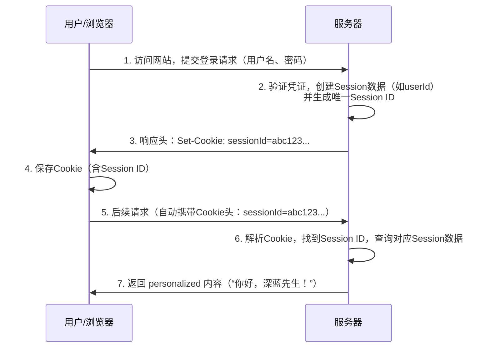

Cookie 和 Session 是 Web 开发中两个非常重要且紧密相关的概念，它们共同解决了 HTTP 协议无状态（Stateless）带来的问题。

### 一、核心比喻

为了更好地理解，我们可以用一个非常形象的比喻：

*   **Session** 就像你在**银行保险箱**里存放的贵重物品（你的会话数据）。
*   **Cookie** 就像银行给你的**保险箱钥匙**（Session ID）。你每次去银行（访问网站），只需要出示这把钥匙（Cookie），银行就能找到对应的保险箱，让你存取里面的东西。
*   **没有这把钥匙（Cookie）**，银行职员（服务器）就无法知道哪个保险箱是你的，你每次去都像一个陌生人。

---

### 二、什么是 Cookie？

**1. 定义：**
::: tip Cookie
Cookie 是一小段文本信息（通常不超过 4KB），由**服务器**通过 HTTP 响应头（`Set-Cookie`）发送给**客户端（通常是浏览器）**。浏览器会将其保存起来，并在后续的每一次针对同一服务器的请求中，自动通过 HTTP 请求头（`Cookie`）将其带回给服务器。
:::
**2. 主要特点：**
*   ==存储在客户端=={.note}：数据保存在用户的浏览器中。
*   ==有生命周期=={.note}：可以设置过期时间。可以是“会话期 Cookie”（浏览器关闭即失效），也可以是“持久性 Cookie”（在设定的日期过后失效）。
*   ==自动携带=={.note}：浏览器会在符合条件（域名、路径、过期时间等）的请求中自动携带相应的 Cookie，无需开发者手动处理。
*   ==不安全=={.note}：因为存储在客户端，用户可以看到并可能修改 Cookie 内容。**绝对不要在其中存储敏感信息（如密码）**。

**3. 常见用途：**
*   用户登录状态保持（通常存储的是 Session ID）。
*   记录用户的个性化设置（如主题、语言偏好）。
*   记录用户行为（如购物车商品、浏览历史）。

**4. 如何设置过期时间：**

Cookie 的生命周期可以通过以下两种主要方式设置：

1.  **`expires`**：设置一个**具体的过期日期/时间**（GMT 格式）。
2.  **`max-age`**：设置一个以**秒**为单位的有效时长，从 cookie 被设置的那一刻开始计算。

**最佳实践是优先使用 `max-age`，因为它更简单直观（基于相对时间，而非绝对时间）。**

---

具体设置方法

设置 Cookie 是通过服务器在 HTTP 响应头中添加 `Set-Cookie` 字段来完成的。其基本语法如下：

```
Set-Cookie: <cookie-name>=<cookie-value>; expires=<GMT-date>; max-age=<seconds>; path=/; domain=.example.com; Secure; HttpOnly
```

生命周期只关注 `expires` 和 `max-age` 部分。

1. 使用 `max-age`（推荐）

`max-age` 的值是一个数字，单位是秒。它告诉浏览器从接收到这个 Cookie 开始，多少秒之后这个 Cookie 会过期。

**示例：**

*   **设置一个 1 小时后过期的 Cookie：**
    ```http
    Set-Cookie: username=jinran; max-age=3600; path=/
    ```
    （因为 1小时 * 60分钟 * 60秒 = 3600 秒）

*   **设置一个 30 天后过期的 Cookie：**
    ```http
    Set-Cookie: theme=dark; max-age=2592000; path=/
    ```
    （因为 30天 * 24小时 * 60分钟 * 60秒 = 2,592,000 秒）

*   **设置一个会话期 Cookie（浏览器关闭即失效）：**
    不设置 `expires` 或 `max-age` 属性即可。
    ```http
    Set-Cookie: sessionid=abc123; path=/
    ```

*   **立即删除一个已存在的 Cookie：**
    将 `max-age` 设置为 `0` 或一个负数，并保证 Cookie 的 `name`, `path`, `domain` 等属性与要删除的 Cookie 完全一致。
    ```http
    Set-Cookie: username=; max-age=0; path=/
    ```

2. 使用 `expires`

`expires` 的值是一个具体的 GMT 格式的日期时间字符串。它告诉浏览器这个 Cookie 在哪个确切的时间点之后会过期。

**示例：**

*   **设置一个在 2030 年 1 月 1 日过期的 Cookie：**
    ```http
    Set-Cookie: user_id=12345; expires=Tue, 01 Jan 2030 00:00:00 GMT; path=/
    ```

*   **设置一个 7 天后过期的 Cookie（需要代码计算日期）：**
    这通常在服务器端代码中动态计算完成。

---

在不同编程语言中的实现示例:

#### 在 Node.js (Express) 中

```javascript
const express = require('express');
const app = express();

app.get('/set-cookie', (req, res) => {
  // 使用 max-age (推荐)
  res.cookie('username', 'jinran', { maxAge: 3600000, httpOnly: true }); // 注意：Express 中 maxAge 单位是毫秒

  // 使用 expires
  const expiryDate = new Date(Date.now() + 60 * 60 * 1000); // 1小时后
  res.cookie('theme', 'dark', { expires: expiryDate, httpOnly: true });

  // 删除 Cookie
  res.cookie('username', '', { maxAge: 0 });

  res.send('Cookie has been set!');
});
```

#### 在 Python (Flask) 中

```python
from flask import Flask, make_response
from datetime import datetime, timedelta

app = Flask(__name__)

@app.route('/set-cookie')
def set_cookie():
    resp = make_response('Cookie set!')
    
    # 使用 max-age
    resp.set_cookie('username', 'jinran', max_age=3600)
    
    # 使用 expires (需要 datetime 对象)
    expiry_time = datetime.now() + timedelta(days=30)
    resp.set_cookie('theme', 'dark', expires=expiry_time)
    
    return resp
```

| 你想要的效果 | 设置方法 |
| :--- | :--- |
| **创建一个持久 Cookie** | 使用 `max-age=<seconds>`（推荐）或 `expires=<GMT-date>` |
| **创建一个会话期 Cookie** | **不设置** `max-age` 和 `expires` 属性 |
| **删除一个 Cookie** | 设置 `max-age=0` 或 `expires` 为一个过去的时间点 |

记住，在设置 Cookie 时，通常还应考虑其他重要属性，如：
*   `path=/`：确保 Cookie 在整个网站下都有效。
*   `HttpOnly`：防止 JavaScript 访问，增强安全性（针对 XSS 攻击）。
*   `Secure`：要求只能通过 HTTPS 协议传输 Cookie。
*   `SameSite=Lax/Strict`：控制第三方跨站请求时是否发送 Cookie，针对 CSRF 攻击。
---

### 三、什么是 Session？

**1. 定义：**
::: tip Session
Session 代表的是一次用户会话的过程。Session 数据**存储在服务器端**（如内存、数据库、文件系统中）。每个 Session 都有一个唯一的标识符，称为 **Session ID**。
:::
**2. 主要特点：**
*   ==存储在服务器端=={.note}：数据保存在服务器上，相对安全。
*   ==依赖于客户端标识=={.note}：服务器需要一种方式将每个客户端与其对应的 Session 数据关联起来，这个方式就是通过 Session ID。
*   ==可以存储更大量、更复杂的数据=={.note}：因为数据在服务器端，不受 Cookie 的 4KB 大小限制。
*   ==有生命周期=={.note}：通常会有一个超时时间。用户长时间不活动（例如30分钟），或者关闭浏览器（如果 Session ID 是会话期 Cookie），Session 可能会被服务器销毁。

**3. 常见用途：**
*   存储用户的登录凭证、用户 ID 等敏感信息。
*   存储购物车的完整内容。
*   在一次会话过程中需要临时保存的表单数据。

---

### 四、联系与区别（表格对比）

| 特性          | Cookie                  | Session                                |
|:------------|:------------------------|:---------------------------------------|
| **存储位置**    | **客户端**（浏览器）            | **服务器端**（内存、数据库等）                      |
| **安全性**     | **较低**，用户可查看、修改         | **较高**，数据存储在服务器，用户无法直接修改               |
| **数据类型与大小** | 只支持字符串，单个大小通常限 **4KB**  | 可支持任意数据类型（对象等），大小理论上只受服务器资源限制          |
| **生命周期**    | 可设置长期有效（持久Cookie）       | 通常有效时间较短（如用户 inactive 30分钟）            |
| **性能影响**    | 不占用服务器资源，但每次请求都会携带，增加带宽 | 占用服务器资源，用户量巨大时对服务器压力大                  |
| **依赖关系**    | 可以独立使用，用于存储简单偏好         | **通常依赖 Cookie 来传递 Session ID** 以识别用户身份 |

---

### 五、它们如何协同工作？（典型流程）

下图直观地展示了 Cookie 和 Session 在用户登录场景中是如何协同工作的：



### 六、其他实现方式：不使用 Cookie 的 Session

虽然最常见的方式是通过 Cookie 传递 Session ID，但如果用户禁用了 Cookie，还可以通过其他方式传递，但都比较麻烦：

1.  **URL 重写**：将 Session ID 作为 URL 的一个参数附加在每一个链接后面（例如：`http://example.com/index.php?sessionid=abc123`）。
2.  **隐藏表单域**：将 Session ID 放在表单的隐藏字段中，随着表单提交。

但这些方法都不如 Cookie 方便和安全，因此现在绝大多数网站都要求启用 Cookie 才能正常使用。

### 总结

*   **Cookie 是客户端的存储机制，Session 是服务器端的存储机制。**
*   **Session 的实现通常需要 Cookie 来保存和传递身份凭证（Session ID）。**
*   **Cookie 适合存储不敏感、小量的数据；Session 适合存储敏感、大量的临时会话数据。**

它们相辅相成，共同为我们提供了无缝、连续、个性化的上网体验。
