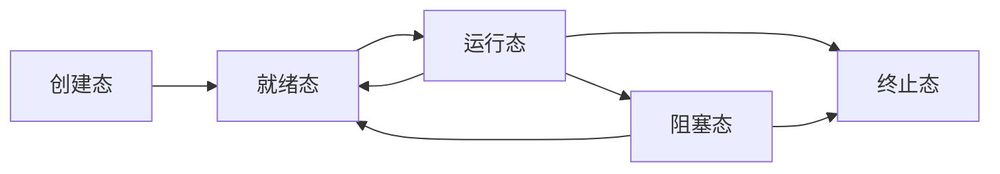

## 一、进程：程序运行的独立单元

### 1.1 什么是进程？

::: tip 概念
进程（Process）是**程序在计算机上的一次动态执行过程**，是操作系统进行资源分配和调度的基本单位。简单来说，当你双击打开一个应用程序（如浏览器、编辑器），操作系统就会为其创建一个进程，并分配所需的资源（内存、CPU时间、文件句柄等）。
:::

进程是一个抽象概念，它不仅包含程序的代码和数据，还包含了程序运行时的状态信息（如计数器、寄存器、内存指针等）。每个进程都有自己独立的地址空间，彼此之间互不干扰。

### 1.2 进程的核心特性

- **独立性**：进程拥有独立的内存空间和系统资源，一个进程崩溃通常不会影响其他进程（除非设计缺陷导致全局资源损坏）。
- **动态性**：进程是动态的执行过程，有创建、运行、暂停、终止等生命周期状态。
- **并发性**：操作系统可以同时运行多个进程（通过CPU时间分片实现宏观上的并行）。
- **结构性**：进程由程序代码、数据、进程控制块（PCB）三部分组成，其中PCB是进程存在的唯一标志，记录了进程的ID、状态、内存地址等关键信息。

### 1.3 进程的生命周期

进程从创建到终止会经历以下状态变化：
1. **创建态**：操作系统为进程分配资源，初始化PCB。
2. **就绪态**：进程已准备好运行，等待CPU调度。
3. **运行态**：进程获得CPU时间，正在执行指令。
4. **阻塞态**：进程因等待资源（如I/O操作、锁）而暂停，释放CPU。
5. **终止态**：进程完成执行或被强制结束，操作系统回收其资源。

## 二、线程：进程内的执行单元

### 2.1 什么是线程？
::: tip 概念
线程（Thread）是**进程内的一个单一执行流**，是操作系统调度的最小单位。**一个进程可以包含多个线程**，这些线程共享进程的内存空间和资源，但拥有各自独立的执行上下文（如程序计数器、寄存器、堆栈）。
:::
如果把进程比作一个正在运行的工厂，那么线程就是工厂里的工人——工厂（进程）提供场地和设备（资源），工人（线程）负责具体的生产任务（执行代码），多个工人可以并行工作但共享工厂资源。

### 2.2 线程的核心特性

- **共享性**：同一进程的所有线程共享进程的内存空间（代码段、数据段、堆）和系统资源（如打开的文件、网络连接），但线程私有栈和寄存器。
- **轻量级**：线程的创建、销毁和切换开销远小于进程（无需分配独立内存空间）。
- **并发性**：同一进程内的多个线程可以并发执行，提高程序效率。
- **依赖性**：线程不能独立存在，必须依附于进程；若进程终止，其所有线程也会随之销毁。

### 2.3 线程的分类

根据调度方式的不同，线程可分为两类：
- **用户级线程**：由用户程序（如编程语言运行时）管理，操作系统无法感知，切换效率高但无法利用多核CPU。
- **内核级线程**：由操作系统内核直接管理，可被调度到不同CPU核心执行，能充分利用多核资源但切换开销略高。

现代操作系统（如Windows、Linux）通常采用"一对一"模型：一个用户级线程对应一个内核级线程，兼顾效率与多核利用。

## 三、进程与线程的核心区别与联系

### 3.1 核心区别

| 维度                | 进程（Process）                     | 线程（Thread）                     |
|---------------------|-------------------------------------|-------------------------------------|
| 资源分配            | 操作系统资源分配的基本单位（独立内存、文件句柄等） | 不拥有独立资源，共享所属进程的资源   |
| 调度单位            | 操作系统调度的基本单位（但调度开销大）         | 操作系统调度的最小单位（调度开销小） |
| 地址空间            | 独立地址空间，进程间地址不共享             | 共享所属进程的地址空间               |
| 崩溃影响            | 单个进程崩溃不影响其他进程                 | 线程崩溃可能导致整个进程崩溃         |
| 通信方式            | 需通过IPC机制（管道、信号量、共享内存等）     | 可通过共享内存直接通信（需同步机制） |
| 创建/销毁开销       | 大（需分配资源、初始化PCB）               | 小（仅需初始化线程上下文）           |

### 3.2 内在联系

- 线程是进程的组成部分，一个进程至少包含一个线程（称为主线程）。
- 进程为线程提供运行所需的资源（内存、CPU时间等），线程是进程的实际执行单元。
- 进程的所有线程共享进程的全局变量、文件描述符等资源，但线程间的协作需要同步机制（如锁、信号量）避免资源竞争。
- 进程和线程都具有生命周期（创建、就绪、运行、阻塞、终止），但线程的状态变化更灵活。

## 四、多进程与多线程的应用场景

### 4.1 多进程的典型应用场景

- **稳定性优先的程序**：如浏览器（每个标签页一个进程，单个页面崩溃不影响其他页面）、数据库服务（多个客户端连接对应多个进程，隔离故障）。
- **资源隔离需求**：如沙箱环境（通过进程隔离限制恶意程序权限）、容器技术（Docker本质是轻量级进程隔离）。
- **CPU密集型任务**：如视频渲染、科学计算（多进程可利用多核CPU并行处理）。

### 4.2 多线程的典型应用场景

- **I/O密集型任务**：如网络请求、文件读写（线程等待I/O时可释放CPU，其他线程继续执行）。
- **实时响应需求**：如GUI程序（主线程处理界面渲染，子线程处理后台计算，避免界面卡顿）。
- **高并发服务**：如Web服务器（一个进程内的多线程处理多个客户端请求，减少资源开销）。

## 五、总结：进程与线程的本质

进程和线程的设计本质是为了**提高计算机系统的资源利用率和任务并发能力**：
- 进程通过隔离资源实现了程序的独立运行，保证了系统的稳定性。
- 线程通过共享资源降低了并发开销，提高了程序的执行效率。

理解进程与线程的核心差异，有助于我们在实际开发中选择合适的并发模型：需要隔离时用多进程，需要高效协作时用多线程。无论是前端开发中浏览器的多进程架构（如渲染进程、GPU进程），还是后端服务的线程池设计，都是进程与线程特性的具体应用。

记住一句话：**进程是资源分配的边界，线程是任务调度的边界**，这便是两者最核心的区别。