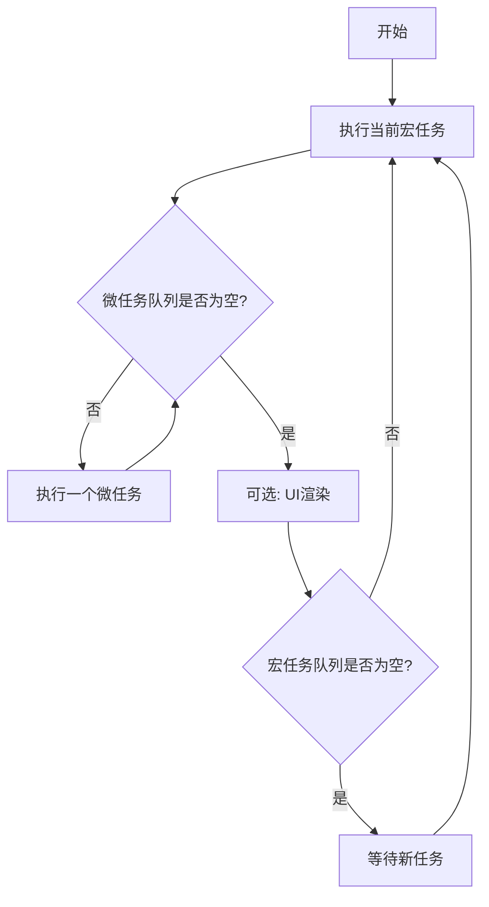
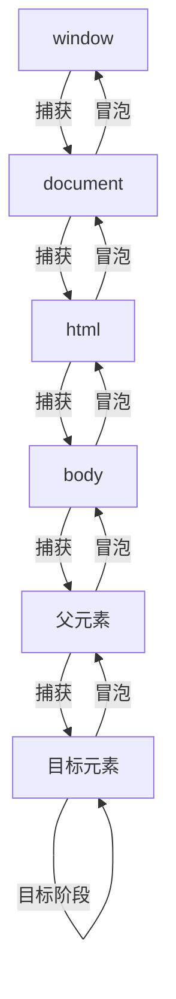

JavaScript 的事件系统是前端开发的核心基础，包括**事件循环机制**（控制代码执行顺序）和**事件传播机制**（控制交互事件的流动）。本文将用清晰的语言和图示，彻底讲透这两大机制的执行逻辑。

## 一、JavaScript 事件循环：代码执行的"调度中心"

JavaScript 是单线程语言，一次只能执行一个任务。为了处理异步操作（如网络请求、定时器等），浏览器设计了**事件循环（Event Loop）** 机制来调度代码执行顺序。

### 1.1 核心概念：任务队列与执行规则

事件循环的核心是将任务分为两类，按优先级依次执行：

- **宏任务（Macrotask）**：优先级较低的任务，包括
    - 整体脚本代码（初始执行的代码）
    - `setTimeout`/`setInterval` 回调
    - DOM 事件回调（如点击、输入）
    - I/O 操作（如网络请求、文件读取）

- **微任务（Microtask）**：优先级较高的任务，包括
    - `Promise.then`/`catch`/`finally` 回调
    - `queueMicrotask` 注册的任务
    - `MutationObserver`（DOM 变化监听）


### 1.2 事件循环的执行流程

事件循环按照"**先微后宏，一次一清**"的规则反复执行，具体步骤如下：

1. **执行初始宏任务**：首先执行当前的宏任务（通常是整个脚本代码）。
2. **清空微任务队列**：当前宏任务执行完毕后，立即执行所有微任务，直到微任务队列为空。
3. **UI 渲染（可选）**：浏览器可能在此时进行页面渲染（非必选，由浏览器决定时机）。
4. **循环执行**：从宏任务队列中取出下一个宏任务，重复步骤 1-3。

#### 执行顺序图示



### 1.3 经典执行顺序示例解析

以下代码的输出顺序是理解事件循环的关键：

```javascript
console.log('1. 同步代码开始');

setTimeout(() => {
  console.log('4. setTimeout宏任务');
}, 0);

Promise.resolve().then(() => {
  console.log('3. Promise微任务');
});

console.log('2. 同步代码结束');
```

**执行步骤拆解**：
1. 执行同步代码（宏任务），输出 `1. 同步代码开始` 和 `2. 同步代码结束`。
2. 当前宏任务执行完毕，检查微任务队列，发现 `Promise.then` 回调，执行并输出 `3. Promise微任务`。
3. 微任务队列清空，从宏任务队列取出 `setTimeout` 回调，执行并输出 `4. setTimeout宏任务`。

**输出顺序**：`1 → 2 → 3 → 4`

复杂一些的例子：

```javascript
async function async1() {
    console.log('async1 start');
    await async2();
    console.log('async1 end');
}

async function async2() {
    console.log('async2');
}

console.log('script start');

setTimeout(function () {
    console.log('setTimeout');
}, 0);

async1();

new Promise(function (resolve) {
    console.log('promise1');
    resolve();
}).then(function () {
    console.log('promise2');
});

console.log('script end');
```

**执行步骤拆解**：
1. 执行同步代码（宏任务）：
    - 输出 'script start'
    - 调用 async1()，输出 'async1 start'
    - 执行 await async2()，输出 'async2'，将 async1 剩余代码放入微任务队列
    - 执行 Promise 构造函数，输出 'promise1'，将 then 回调放入微任务队列
    - 输出 'script end'

2. 执行微任务队列：
    - 执行 async1 剩余代码，输出 'async1 end'
    - 执行 Promise then 回调，输出 'promise2'

3. 执行宏任务队列：
    - 执行 setTimeout 回调，输出 'setTimeout'

**输出顺序**：

`script start → async1 start → async2 → promise1 → script end → async1 end → promise2 → setTimeout`

## 二、DOM 事件传播：交互事件的"流动路径"

当用户点击按钮、输入文本等交互操作发生时，事件并非只在目标元素上触发，而是会经历一个**从外层到内层再回到外层**的传播过程，这就是事件传播机制。

### 2.1 事件传播的三个阶段

事件传播分为三个依次执行的阶段，如同"投石入水"的涟漪效应：

1. **捕获阶段（Capture Phase）**
    - 事件从最外层的 `window` 开始，**由外到内**向目标元素传播。
    - 路径：`window → document → html → body → ... → 目标元素的父级`。
    - 只有通过 `addEventListener(..., { capture: true })` 注册的监听器才会在这个阶段触发。

2. **目标阶段（Target Phase）**
    - 事件到达实际触发的目标元素本身。
    - 无论是否设置捕获，目标元素上的所有监听器都会在此阶段触发（顺序由注册顺序决定）。

3. **冒泡阶段（Bubble Phase）**
    - 事件从目标元素**由内到外**向最外层传播，与捕获阶段路径相反。
    - 路径：`目标元素 → 父级 → ... → body → html → document → window`。
    - 默认情况下（`addEventListener` 未设置 `capture`），监听器在此阶段触发。

#### 传播阶段图示



### 2.2 事件传播的控制方法

可以通过事件对象的方法控制传播流程：

- **`e.stopPropagation()`**：阻止事件继续传播到下一个阶段或元素（但当前元素的其他监听器仍会执行）。
- **`e.stopImmediatePropagation()`**：立即阻止事件传播，且当前元素的其他监听器也不会执行。
- **`e.preventDefault()`**：仅阻止事件的默认行为（如链接跳转、表单提交），不影响传播流程。


## 三、事件委托：高效利用事件传播

事件委托是基于冒泡阶段的经典优化技巧，核心思想是"**父元素代理子元素的事件监听**"。

### 3.1 事件委托的原理

由于事件会冒泡到父元素，因此无需为每个子元素单独注册监听器，只需在父元素上注册一次，即可通过判断事件的目标元素（`e.target`）来处理所有子元素的事件。

#### 优势
- **性能优化**：减少监听器数量（1 个父元素监听器替代 N 个子元素监听器）。
- **动态兼容**：新增子元素无需重新注册监听器，自动继承事件处理。


## 四、总结：关键知识点梳理

1. **事件循环**决定代码执行顺序：
    - 先执行同步代码（宏任务），再清空所有微任务，最后执行下一个宏任务。
    - 微任务优先级高于宏任务，同一轮循环中微任务会全部执行完毕。

2. **事件传播**决定交互事件流动：
    - 经历捕获（外→内）→ 目标（元素本身）→ 冒泡（内→外）三个阶段。
    - 默认监听器在冒泡阶段触发，可通过 `capture: true` 改为捕获阶段。

3. **实践技巧**：
    - 用事件委托优化大量子元素的事件监听。
    - 用 `stopPropagation` 控制事件传播范围，避免不必要的触发。
