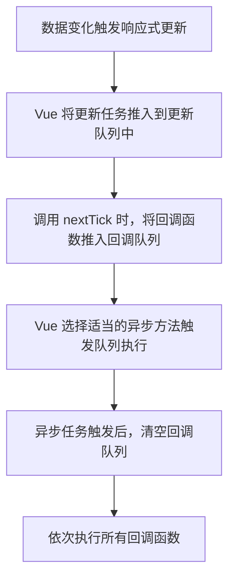

## 什么是 nextTick？

`nextTick` 是 Vue 提供的一个全局 API，可以让开发者在当前数据更新完成、DOM 更新完成后执行特定的回调函数。它主要解决了 Vue 的异步 DOM 更新机制下，数据变化与 DOM 更新之间的时间差问题。

### nextTick 的主要特点：
- ==**延迟执行回调**=={.note} ——在 DOM 更新完成后执行回调函数。
- ==**保证状态一致**=={.note} ——在数据更新后确保回调中操作的是最新的 DOM。
- ==**优化性能**=={.note} ——通过批量更新和去重机制，减少不必要的 DOM 操作。

## 为什么需要 nextTick？

Vue 在响应式数据更新时采用的是 **异步更新机制**。当数据变化时，Vue 并不会立即更新 DOM，而是将这些更新操作推入到一个 **更新队列（update queue）** 中，等到当前事件循环结束后再统一执行。

这种机制的优点是：
- 避免频繁的 DOM 操作，提升性能。
- 合并多次对同一数据的修改，减少不必要的计算和渲染。

然而，这也导致了一个问题：在数据变化后立即操作 DOM，可能会获取到旧的 DOM 状态。此时，`nextTick` 就成为了解决方案。

## nextTick 的使用场景

### 1. 在数据更新后操作 DOM
当需要在数据变化后立即操作 DOM 时，`nextTick` 确保 DOM 已完成更新。例如，动态设置样式、获取元素尺寸等。

### 2. 解决异步更新问题
在 Vue 的异步更新机制下，`nextTick` 可以确保逻辑在 DOM 更新完成后执行，避免操作未更新的 DOM。

### 3. 动画或过渡效果
在动画或过渡效果中，`nextTick` 用于确保动画的执行时机准确，例如在 DOM 更新后添加动画类名。

### 4. 与第三方库结合
当使用第三方库（如图表库、高级表单库）时，`nextTick` 可以确保 DOM 已更新，从而避免操作错误的 DOM 节点。

## nextTick 的实现原理

`nextTick` 的实现依赖于 **任务队列** 和 **异步任务机制**，==其核心思想是将回调函数推入任务队列中，通过异步方法在 DOM 更新后清空队列并依次执行这些函数。=={.important}

实现步骤：
1. **维护回调队列**  
   Vue 内部维护了一个回调队列（`callbacks`），所有调用 `nextTick` 的回调函数都会被加入到这个队列中。

2. **选择异步方法**  
   根据运行环境，Vue 会选择最优的异步方法触发队列执行。优先级如下：
   - **Promise**（微任务，优先级最高，现代浏览器支持）
   - **MutationObserver**（微任务，用于监听 DOM 变化）
   - **setImmediate**（宏任务，部分环境支持）
   - **setTimeout**（宏任务，兜底方案）

3. **清空队列并执行回调**  
   当异步任务触发时，Vue 会清空回调队列，并按顺序执行所有回调函数。

## nextTick 的异步机制详解

Vue 的 `nextTick` 基于浏览器的任务机制实现，结合了 **微任务** 和 **宏任务**。以下是各任务的优先级和特点：

==**_（关于宏任务与微任务，参考这篇文章：[宏任务与微任务](/前端开发/宏任务与微任务.md)）_**==

1. **微任务（Microtasks）**  
   - 微任务的执行优先级高于宏任务。
   - `Promise.then` 和 `MutationObserver` 属于微任务。
   - Vue 优先选择微任务方式实现 `nextTick`，确保回调尽快执行。

2. **宏任务（Macrotasks）**  
   - 宏任务的优先级低于微任务。
   - `setImmediate` 和 `setTimeout` 属于宏任务。
   - 如果微任务不可用，Vue 会退而使用宏任务来实现。

## nextTick 的执行流程

以下是 `nextTick` 的完整执行流程：

## 使用 nextTick 的注意事项

1. **避免滥用 nextTick**  
   - `nextTick` 应该只在需要操作最新 DOM 时使用。
   - 如果只是简单的数据更新，无需调用 `nextTick`。

2. **合理规划更新逻辑**  
   - Vue 的异步更新机制已经足够高效，大部分情况下不需要显式调用 `nextTick`。

3. **注意微任务与宏任务的区别**  
   - 如果在 `nextTick` 中再次触发数据更新，可能会导致新的 DOM 更新周期，需避免不必要的嵌套调用。

4. **结合 Promise 使用**  
   - 现代浏览器中，`nextTick` 支持 Promise，因此可以与 `async/await` 结合使用，简化代码逻辑。

## 总结

`nextTick` 是 Vue 提供的一个重要工具，用于解决异步更新机制带来的 DOM 操作问题。通过将回调函数推入任务队列并使用异步方法执行，`nextTick` 确保了回调函数能够操作最新的 DOM。

### 核心要点回顾
1. **作用**：延迟执行回调，确保 DOM 更新完成后操作。
2. **使用场景**：数据更新后操作 DOM、动画效果、与第三方库结合等。
3. **实现原理**：基于任务队列，结合微任务（如 Promise）和宏任务（如 setTimeout）。
4. **异步优先级**：Promise > MutationObserver > setImmediate > setTimeout。

通过合理使用 `nextTick`，可以更高效地管理 Vue 应用的 DOM 更新流程，提升代码的可维护性和运行性能。